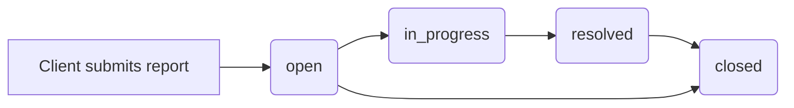

The support system connects clients, vendors, and admins through a shared ticket lifecycle. There are five surfaces involved:

<CardGroup cols={2}>
  <Card title="New report (client)" icon="circle-plus" href="/features/support-tickets#submitting-a-ticket-client">
    Clients report problems with delivered orders from their dashboard.
  </Card>
  <Card title="My tickets (client)" icon="inbox" href="/features/support-tickets#viewing-tickets-client">
    Clients track conversation history and resolution details.
  </Card>
  <Card title="Ticket management (admin)" icon="headset" href="/features/support-tickets#admin-ticket-management">
    Admins triage, assign, and resolve all incoming tickets.
  </Card>
  <Card title="Coupon creation (admin)" icon="tag" href="/features/support-tickets#coupon-creation">
    Admins issue discount coupons to compensate affected clients.
  </Card>
  <Card title="Bug report (public)" icon="bug" href="/features/support-tickets#public-bug-report">
    Anyone can report a platform defect without logging in.
  </Card>
</CardGroup>

---

## Ticket lifecycle



Status transitions are made manually by admins using the status dropdown on each ticket card.

---

## Submitting a ticket (client)

**Route:** `/cliente/soporte/nuevo`  
**Component:** `src/pages/client/Support/NewReport.jsx`

Clients can report a problem only against orders that have already been delivered (`status === 'delivered'`). Orders can also be pre-selected by passing `?orderId=<id>` in the URL (e.g. from an order-detail page).

### Issue types

Clients select from eight issue categories, each pre-assigned a priority:

| Issue type | Label | Priority |
|---|---|---|
| `stain` | Manchas en la tela | High |
| `wrong_color` | Color incorrecto | High |
| `wrong_meters` | Metraje incorrecto | High |
| `damaged` | Tela dañada en transporte | High |
| `wrong_fabric` | Tela equivocada | High |
| `loose_threads` | Hilos sueltos | Medium |
| `quality` | Calidad diferente a la esperada | Medium |
| `other` | Otro problema | Low |

High-priority issue types display a **Caso prioritario** warning banner before the submit button, informing the client they will receive a response within hours.

### Submitting a report

<Steps>
  <Step title="Select the order">
    Choose the delivered order from the dropdown. Only delivered orders appear. If the client navigated from an order page with `?orderId`, the order is pre-selected.
  </Step>
  <Step title="Choose an issue type">
    Click one of the eight issue-type tiles. The selected tile gets a primary-colour ring highlight. The tile also shows an urgency badge (Urgente / Normal / Bajo).
  </Step>
  <Step title="Describe the problem">
    Write a detailed description (up to 500 characters). A live character counter is shown below the textarea.
  </Step>
  <Step title="Attach photos (optional)">
    Upload up to 5 images of the problem. Photos are previewed inline with an individual remove button per photo. Attaching photos speeds up resolution.
  </Step>
  <Step title="Submit">
    Click **Enviar Reporte**. The button shows a spinner while submitting. On success, the client is redirected to `/cliente/soporte/tickets`.
  </Step>
</Steps>

<Note>
  The submit button is disabled until an order, an issue type, and a description are all provided.
</Note>

The created ticket object contains: `id`, `clientId`, `clientName`, `orderId`, `subject` (the issue label), `issueType`, `description`, `priority`, `status: 'open'`, `photos`, `createdAt`, `updatedAt`, and an empty `responses` array.

---

## Viewing tickets (client)

**Route:** `/cliente/soporte/tickets`  
**Component:** `src/pages/client/Support/MyTickets.jsx`

The my-tickets page shows all support tickets associated with the logged-in client. When `supportTickets` in `MetricsContext` is empty it falls back to three hard-coded mock tickets for demonstration purposes.

### Status filter

Four filter buttons at the top let clients narrow by status. Each button shows a count badge:

```
Todos  |  Abiertos  |  En Revisión  |  Resueltos
```

A **Nuevo Reporte** link button on the same row navigates to `/cliente/soporte/nuevo`.

### Ticket cards

Each ticket is an accordion card. Clicking the card header expands or collapses the detail panel.

**Collapsed state** shows:
- Issue title and status badge
- Ticket number, linked order number, and creation date
- Response count (if any responses exist)

**Expanded state** shows:

<AccordionGroup>
  <Accordion title="Original report">
    The client's original description and any attached photo thumbnails (displayed as 20×20 grey placeholder boxes).
  </Accordion>
  <Accordion title="Conversation thread">
    All `responses` rendered as chat bubbles. Admin responses (`from: 'admin'`) appear on the left with a purple badge labelled **Soporte**. Seller responses (`from: 'seller'`) appear on the left with a blue badge labelled **Vendedor**. Client messages appear on the right.
  </Accordion>
  <Accordion title="Resolution details">
    For `resolved` tickets that have a `resolutionDetails` string, a green panel at the bottom shows the resolution summary (e.g. *"Se realizó reembolso completo de $185,000 COP"`*).
  </Accordion>
  <Accordion title="Reply box">
    For `open` and `in_progress` tickets, a text input and **Enviar** button let the client add a follow-up message to the thread.
  </Accordion>
</AccordionGroup>

---

## Admin ticket management

**Route:** `/admin/soporte/tickets`  
**Component:** `src/pages/admin/Support/TicketManagement.jsx`

Admins see all tickets across all clients. Data comes from `supportTickets` in `MetricsContext`. Two actions are available per ticket: status change and agent assignment.

### Status filter buttons

```
Todos  |  Abiertos  |  En Progreso  |  Resueltos
```

Each button shows the count of tickets in that state.

### Summary cards

| Card | Description |
|---|---|
| Total Tickets | All tickets regardless of status |
| Pendientes | Tickets with `open` or `in_progress` status (yellow) |
| Resueltos Hoy | Tickets resolved today (green) |
| Prioridad Alta | Unresolved high-priority tickets (red) |

### Ticket list

Each ticket is rendered as a card with:

- Zero-padded ticket ID (e.g. `#0042`), status badge, and priority indicator (`🔴 Alta`, `🟡 Media`, `🟢 Baja`)
- Subject and full description
- Client name, email, linked order ID (if any), and creation date
- A **Ver Detalles** button to open the detail modal

**Inline controls** appear below each ticket description:

1. **Status dropdown** — options: Abierto, En Progreso, Resuelto, Cerrado. Changing the value calls `updateTicketStatus(ticketId, newStatus)` immediately.
2. **Assign to dropdown** — lists all admin users. Selecting a user calls `assignTicket(ticketId, userId)`. The assigned agent's name is displayed next to the dropdown.

### Ticket detail modal

Clicking **Ver Detalles** opens a scrollable modal showing the full ticket with subject, zero-padded ID, status badge, priority, description, client name and email, linked order (if any), and creation timestamp. Two action buttons in the modal footer allow quick status transitions:

- **Marcar en Progreso** — sets status to `in_progress`
- **Marcar como Resuelto** — sets status to `resolved`

Both buttons close the modal after the update.

<Tip>
  Use the **Prioridad Alta** summary card as a daily starting point. High-priority open tickets represent fabric quality issues (stains, wrong colour, damaged delivery) that clients are waiting on urgently.
</Tip>

---

## Coupon creation

**Route:** `/admin/soporte/cupones`  
**Component:** `src/pages/admin/Support/CouponCreation.jsx`

Admins create discount coupons to compensate clients whose support tickets have been resolved, or as promotional tools. Coupon management uses `coupons`, `createCoupon`, and `deactivateCoupon` from `MetricsContext`.

### Summary cards

| Card | Description |
|---|---|
| Total Cupones | All coupons ever created |
| Activos | Coupons with `active === true` |
| Usados Hoy | Sum of `usageCount` across all coupons |
| Expiran Pronto | Active coupons expiring within 7 days (orange) |

### Coupons table

All coupons are listed with: code, discount badge, usage count (with max-uses limit if set), rules summary, expiry date, status badge, and a **Desactivar** button for active non-expired coupons.

**Discount badge** formats:
- Percentage: `15% OFF`
- Fixed amount: `-$50,000`

**Status badges:**

| Condition | Badge |
|---|---|
| Expired | Red — Expirado |
| Active | Green — Activo |
| Inactive | Gray — Inactivo |

Coupons expiring within 7 days show an orange `⚠️ N días` warning below the expiry date. Expired and inactive coupons are shown at 50 % opacity.

### Creating a coupon

Click **Crear Cupón** to open the creation modal.

<Steps>
  <Step title="Enter a code">
    Type an alphanumeric code (e.g. `VERANO2024`). The input auto-uppercases all characters.
  </Step>
  <Step title="Choose discount type and value">
    Select **Porcentaje (%)** or **Valor Fijo ($)** and enter the corresponding value. The placeholder adapts to guide the expected format (`10` for percentage, `50000` for fixed).
  </Step>
  <Step title="Set an expiry date">
    Pick a date using the date picker. This field is required.
  </Step>
  <Step title="Configure rules (optional)">
    Optionally set a minimum purchase amount (COP) and/or a maximum number of uses. You can also check **Solo para nuevos clientes (primera compra)** to restrict the coupon to first-time buyers.
  </Step>
  <Step title="Create">
    Click **Crear Cupón**. The coupon is added via `createCoupon({ code, discountType, discountValue, expiresAt, active: true, rules })` and immediately appears in the table.
  </Step>
</Steps>

### Deactivating a coupon

Click **Desactivar** on any active, non-expired coupon. This calls `deactivateCoupon(couponId)` and immediately flips the coupon's status badge to **Inactivo**. Deactivation cannot be reversed from this UI.

---

## Public bug report

**Route:** `/reportar-fallo`  
**Component:** `src/pages/BugReport.jsx`

The bug report page is publicly accessible without authentication. It is intended for reporting platform defects — not product quality issues (which use the client support ticket flow). It is linked from the public site footer and `Header` component.

### Form fields

| Field | Required | Options |
|---|---|---|
| Título del Problema | Yes | Free text — e.g. *"No puedo agregar productos al carrito"* |
| Tipo | No | Error / Bug · Problema Visual · Sugerencia |
| Severidad | No | Baja · Media · Alta · Crítica |
| Descripción Detallada | Yes | Free text — describe what happened and what was expected |
| Pasos para Reproducir | No | Step-by-step reproduction instructions |

### Submitting

<Steps>
  <Step title="Fill in the title and description">
    Both fields are required. The description should contrast actual behaviour with expected behaviour.
  </Step>
  <Step title="Set type and severity (optional)">
    Severity defaults to **Baja**. Set it to **Crítica** only for blockers that prevent core functionality.
  </Step>
  <Step title="Add reproduction steps (optional)">
    Numbered steps help the technical team reproduce the issue faster.
  </Step>
  <Step title="Click Enviar Reporte">
    A simulated async call runs for 1 second, then a success notification is shown via `useNotification`, and the form resets. The page switches to a confirmation state with a green checkmark and a **Enviar otro reporte** button.
  </Step>
</Steps>

<Note>
  The bug report form targets platform defects (UI bugs, broken features, performance issues). For complaints about a specific order or product — such as wrong colour or damaged fabric — clients should use [New report](/features/support-tickets#submitting-a-ticket-client) in their dashboard instead.
</Note>
